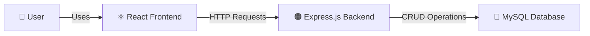
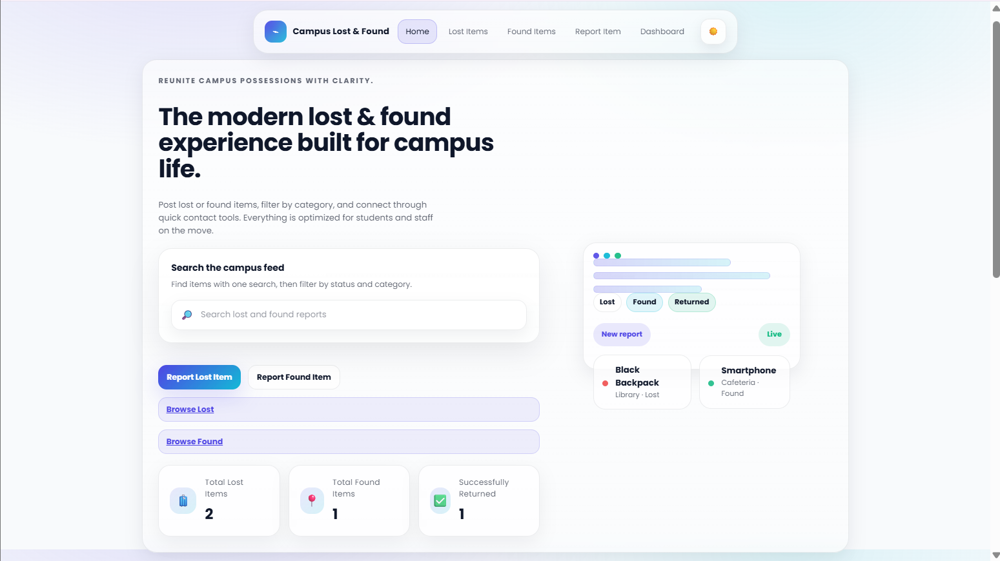
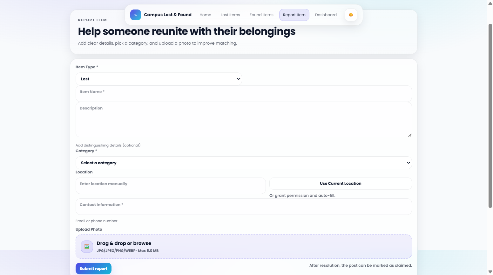
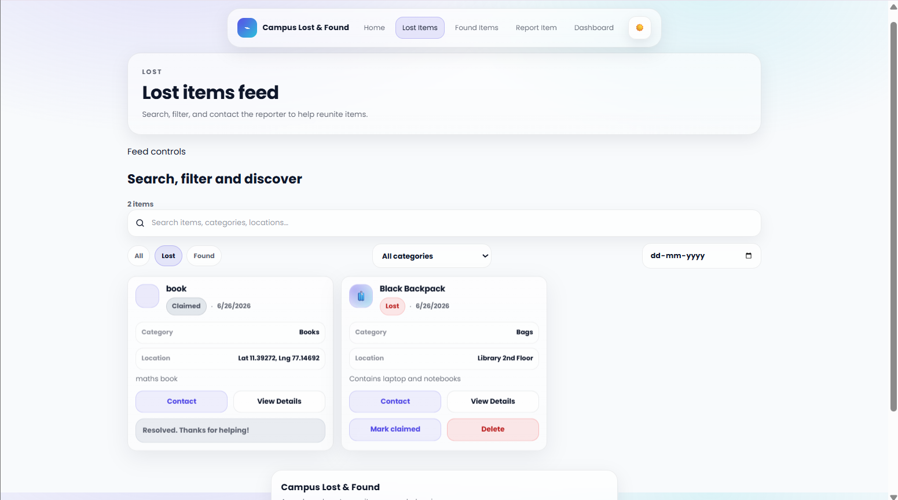
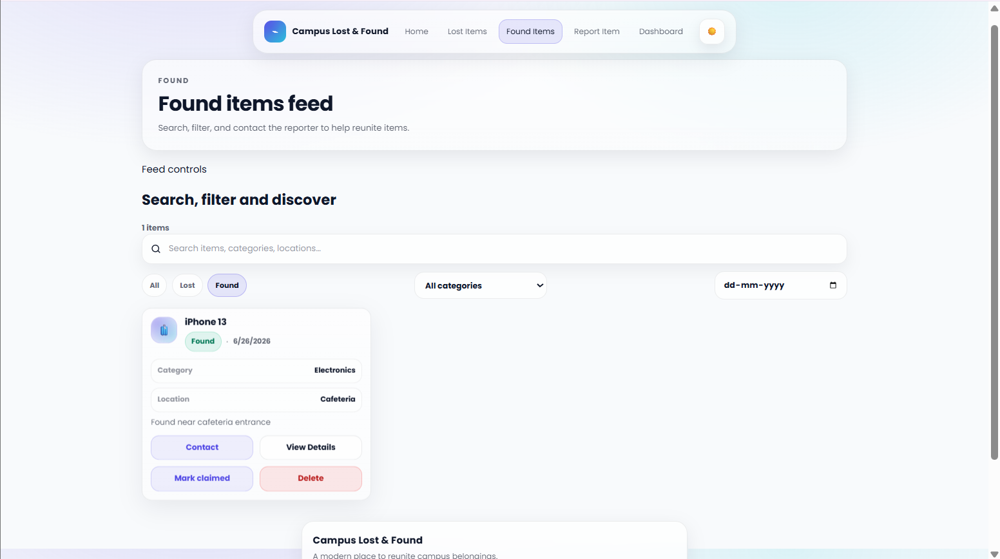

# 🎒 Campus Lost & Found System

A full-stack web application that helps students report, search, and recover lost belongings within a campus. The application provides separate interfaces for reporting lost and found items while storing all information in a MySQL database.

---

## 📌 Project Overview

Managing lost and found items on campus can be difficult when information is shared through informal channels. This application provides a centralized platform where users can:

- Report lost items
- Report found items
- View all reported items
- Help owners recover their belongings

---

## ✨ Features

- 📢 Report Lost Items
- 📢 Report Found Items
- 📋 View Lost Items
- 📋 View Found Items
- 🖼️ Upload Item Images
- 📱 Responsive User Interface
- 🔗 REST API Integration
- 🗄️ MySQL Database

---

## 🏗️ Application Architecture



---

## 🛠️ Tech Stack

### Frontend
- React
- HTML5
- CSS3
- JavaScript

### Backend
- Node.js
- Express.js

### Database
- MySQL 8

### Containerization
- Docker

---

## 📂 Project Structure

```text
lostfound-app
│
├── frontend
│   ├── src
│   ├── public
│   └── package.json
│
├── backend
│   ├── routes
│   ├── controllers
│   ├── config
│   ├── package.json
│   └── server.js
│
├── docker-compose.yml
│
└── README.md
```

---

## ⚙️ Installation

### Clone Repository

```bash
git clone https://github.com/MEGHAAMANICKAM/lostfound-app.git
cd lostfound-app
```

---

### Backend

```bash
cd backend
npm install
npm start
```

---

### Frontend

```bash
cd frontend
npm install
npm start
```

---

## 🐳 Docker

Build Backend Image

```bash
docker build -t lostfound-backend ./backend
```

Build Frontend Image

```bash
docker build -t lostfound-frontend ./frontend
```

---

## 📸 Screenshots

### Home Page



---

### Report Item



---

### Lost Items



---

### Found Items



---

## 🚀 Future Enhancements

- User Authentication
- Email Notifications
- Search & Filtering
- Admin Dashboard
- Cloud Image Storage
- AI-based Item Matching

---

## 👩‍💻 Author

**Meghaa Manickam**